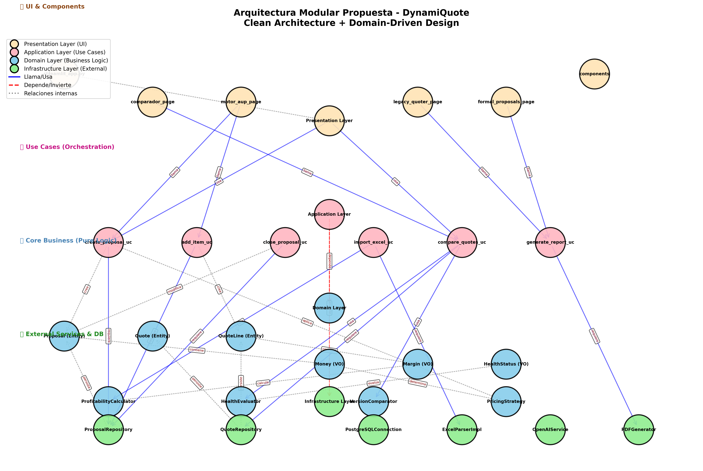

# 🏗️ Propuesta de Arquitectura Modular - DynamiQuote

**Fecha:** 5 de Febrero, 2026  
**Objetivo:** Migrar de arquitectura monolítica a Clean Architecture + DDD  
**Estado Actual:** Percentil 30-35% en arquitectura  
**Objetivo:** Percentil 80-85% en arquitectura  

---

## 📊 Visualización de la Arquitectura



### 🎯 Componentes del Diagrama

**Total de componentes:** 32 módulos  
**Total de relaciones:** 31 dependencias  

#### Distribución por capas:
- 🎨 **Presentation Layer:** 7 módulos (UI & Components)
- 🎯 **Application Layer:** 7 use cases (Orchestration)
- 💎 **Domain Layer:** 11 componentes core (Business Logic)
- 🔧 **Infrastructure Layer:** 7 servicios (External Services & DB)

---

## 🔷 1. PRESENTATION LAYER (Capa de Presentación)

**Color:** Moccasin (#FFE4B5)  
**Responsabilidad:** Interfaz de usuario y componentes visuales  
**Principio:** No contiene lógica de negocio, solo orquesta use cases

### Módulos:
```
src/presentation/
├── streamlit_app.py          # Entry point principal
├── pages/
│   ├── comparador_page.py    # TAB Comparador de Versiones
│   ├── motor_aup_page.py     # TAB Motor AUP
│   ├── legacy_quoter_page.py # TAB Cotizador Legacy
│   └── formal_proposals_page.py # TAB Propuestas Formales
└── components/
    ├── proposal_form.py
    ├── item_editor.py
    └── comparison_chart.py
```

### Relaciones:
- **Llama a:** Application Layer (use cases)
- **NO depende de:** Domain directamente (solo a través de Application)
- **NO depende de:** Infrastructure

---

## 🔷 2. APPLICATION LAYER (Capa de Aplicación)

**Color:** LightPink (#FFB6C1)  
**Responsabilidad:** Casos de uso (orquestación de lógica de negocio)  
**Principio:** Coordina entidades y servicios de dominio

### Use Cases:
```
src/application/use_cases/
├── proposals/
│   ├── create_proposal_uc.py      # Crear nueva propuesta
│   ├── add_item_uc.py             # Agregar ítem a propuesta
│   ├── close_proposal_uc.py       # Cerrar propuesta (inmutable)
│   └── import_excel_uc.py         # Importar Excel
├── quotes/
│   └── compare_quotes_uc.py       # Comparar versiones
└── reports/
    └── generate_report_uc.py      # Generar PDF/reportes
```

### Relaciones:
- **Depende de:** Domain Layer (entities, services, value objects)
- **Requiere:** Infrastructure Layer (repositories, parsers) via Dependency Inversion
- **Llamado por:** Presentation Layer

### Código Migrado:
```python
# ANTES (app.py - línea 1500):
def crear_propuesta_y_agregar_items():
    # UI code
    st.button("Crear")
    # DB query
    cur.execute("INSERT INTO proposals...")
    # Business logic
    margin = calculate_margin(cost, price)
    # Más UI
    st.success("Creado!")

# DESPUÉS (use_cases/create_proposal_uc.py):
class CreateProposalUseCase:
    def __init__(self, proposal_repo: ProposalRepository):
        self._repo = proposal_repo
    
    def execute(self, data: CreateProposalDTO) -> Proposal:
        proposal = Proposal.create(
            origin=data.origin,
            tenant_id=data.tenant_id
        )
        return self._repo.save(proposal)
```

---

## 🔷 3. DOMAIN LAYER (Capa de Dominio - CORE)

**Color:** SkyBlue (#87CEEB)  
**Responsabilidad:** Lógica de negocio pura (sin dependencias externas)  
**Principio:** Center of Clean Architecture - no depende de nadie

### Estructura:
```
src/domain/
├── entities/
│   ├── Proposal (Entity)         # Propuesta con identidad única
│   ├── Quote (Entity)            # Cotización versionada
│   └── QuoteLine (Entity)        # Línea de cotización
├── value_objects/
│   ├── Money (VO)                # Valor inmutable con currency
│   ├── Margin (VO)               # Margen calculado
│   └── HealthStatus (VO)         # Estado: verde/amarillo/rojo
└── services/
    ├── ProfitabilityCalculator   # ← calculate_item_node()
    ├── HealthEvaluator           # ← calculate_health_status()
    ├── VersionComparator         # ← compare_proposals()
    └── PricingStrategy           # ← Aplicación de playbooks
```

### Código Migrado:

#### ANTES (aup_engine.py - línea 110):
```python
def calculate_item_node(item: Dict[str, Any]) -> Dict[str, Any]:
    """Calcula rentabilidad de un ítem."""
    cost_unit = Decimal(str(item.get("cost_unit", 0)))
    quantity = Decimal(str(item.get("quantity", 1)))
    final_price_unit = Decimal(str(item.get("final_price_unit", 0)))
    
    subtotal_cost = cost_unit * quantity
    subtotal_revenue = final_price_unit * quantity
    margin_absolute = final_price_unit - cost_unit
    # ...más cálculos
    return node
```

#### DESPUÉS (domain/services/profitability_calculator.py):
```python
from domain.entities import QuoteLine
from domain.value_objects import Money, Margin

class ProfitabilityCalculator:
    """Domain Service para cálculo de rentabilidad."""
    
    @staticmethod
    def calculate_line_node(line: QuoteLine) -> ProfitabilityNode:
        """
        Calcula nodo de rentabilidad para una línea.
        Lógica pura de dominio sin side effects.
        """
        cost = line.cost_unit.multiply(line.quantity)
        revenue = line.price_unit.multiply(line.quantity)
        
        margin = Margin.from_amounts(
            revenue=revenue,
            cost=cost
        )
        
        health = HealthStatus.evaluate(margin.percentage)
        
        return ProfitabilityNode(
            cost=cost,
            revenue=revenue,
            margin=margin,
            health=health
        )
```

### Relaciones:
- **NO depende de:** Nada externo (Framework-agnostic)
- **Usado por:** Application Layer
- **Usado por:** Infrastructure Layer (para persistencia)

---

## 🔷 4. INFRASTRUCTURE LAYER (Capa de Infraestructura)

**Color:** LightGreen (#90EE90)  
**Responsabilidad:** Implementaciones concretas de servicios externos  
**Principio:** Dependency Inversion - implementa interfaces de Application

### Módulos:
```
src/infrastructure/
├── database/
│   ├── repositories/
│   │   ├── ProposalRepository     # Implementa IProposalRepository
│   │   └── QuoteRepository        # Implementa IQuoteRepository
│   └── PostgreSQLConnection       # Conexión dual PG/SQLite
├── external_services/
│   ├── ExcelParserImpl            # Implementa IExcelParser
│   ├── OpenAIService              # Integración OpenAI
│   └── PDFGenerator               # Generación de reportes
└── migrations/
    └── (migrate_*.py files)
```

### Código Migrado:

#### ANTES (database.py - línea 133):
```python
def save_quote(quote_data: tuple, lines_data: list) -> tuple[bool, str]:
    """Guarda cotización en DB."""
    conn = get_connection()
    cur = conn.cursor()
    try:
        if is_postgres():
            cur.execute("INSERT INTO quotes VALUES (%s, %s, ...)", quote_data)
        else:
            cur.execute("INSERT INTO quotes VALUES (?, ?, ...)", quote_data)
        # ...
    finally:
        conn.close()
```

#### DESPUÉS (infrastructure/repositories/quote_repository.py):
```python
from application.interfaces import IQuoteRepository
from domain.entities import Quote

class PostgreSQLQuoteRepository(IQuoteRepository):
    """Implementación PostgreSQL del repositorio de quotes."""
    
    def __init__(self, connection: DatabaseConnection):
        self._conn = connection
    
    def save(self, quote: Quote) -> Quote:
        """Persiste quote en PostgreSQL."""
        with self._conn.cursor() as cur:
            cur.execute(
                """
                INSERT INTO quotes (id, group_id, version, ...)
                VALUES (%s, %s, %s, ...)
                """,
                (quote.id, quote.group_id, quote.version, ...)
            )
            self._conn.commit()
        return quote
    
    def find_by_id(self, quote_id: str) -> Optional[Quote]:
        """Recupera quote por ID."""
        with self._conn.cursor() as cur:
            cur.execute("SELECT * FROM quotes WHERE id = %s", (quote_id,))
            row = cur.fetchone()
            return Quote.from_db_row(row) if row else None
```

### Relaciones:
- **Implementa:** Interfaces definidas en Application Layer
- **Persiste:** Entidades de Domain Layer
- **Usado por:** Application Layer (injection)

---

## 🔄 Flujo de Dependencias (Clean Architecture)

```
┌─────────────────────────────────────────────────┐
│         PRESENTATION LAYER                      │
│  (UI - Streamlit Pages & Components)            │
└────────────────┬────────────────────────────────┘
                 │ llama
                 ▼
┌─────────────────────────────────────────────────┐
│         APPLICATION LAYER                       │
│  (Use Cases - Orchestration Logic)              │
└────────┬───────────────────────┬────────────────┘
         │ depende               │ requiere
         ▼                       ▼
┌─────────────────────┐  ┌───────────────────────┐
│   DOMAIN LAYER      │  │ INFRASTRUCTURE LAYER  │
│  (Business Logic)   │◄─┤ (Implementations)     │
│  ┌───────────────┐  │  │ ┌──────────────────┐  │
│  │ Entities      │  │  │ │ Repositories     │  │
│  │ Value Objects │  │  │ │ External Services│  │
│  │ Domain Services│ │  │ │ DB Connections   │  │
│  └───────────────┘  │  │ └──────────────────┘  │
└─────────────────────┘  └───────────────────────┘
         ▲                        │
         └────────persiste────────┘
```

### Principios Aplicados:

1. **Dependency Rule:** Las dependencias apuntan hacia adentro (hacia Domain)
2. **Dependency Inversion:** Infrastructure implementa interfaces de Application
3. **Separation of Concerns:** Cada capa tiene una responsabilidad clara
4. **Framework Independence:** Domain no conoce Streamlit, PostgreSQL, etc.

---

## 📈 Comparación: Antes vs. Después

### ANTES (Monolito):
```
app.py (3,387 líneas)
├── UI code (Streamlit widgets)
├── Business logic (calculate_margin)
├── Database queries (cur.execute)
├── External services (OpenAI calls)
└── Validaciones mezcladas

⚠️ PROBLEMA: Todo acoplado, difícil de:
  - Testear (no puedes testear lógica sin DB)
  - Reutilizar (lógica mezclada con UI)
  - Mantener (cambio en UI rompe lógica)
  - Escalar (no se puede separar en microservicios)
```

### DESPUÉS (Modular):
```
src/
├── presentation/streamlit_app.py (< 200 líneas)
│   └── Solo coordina pages
├── application/use_cases/ (< 300 líneas c/u)
│   └── Orquesta domain + infra
├── domain/services/profitability_calculator.py (< 200 líneas)
│   └── Lógica pura, 100% testeable
└── infrastructure/repositories/quote_repo.py (< 250 líneas)
    └── Solo persistencia

✅ BENEFICIOS:
  - Testeable: Domain tiene 0 dependencias
  - Reutilizable: Services se usan desde cualquier UC
  - Mantenible: Cambio en UI no afecta lógica
  - Escalable: Domain puede vivir en otro servicio
```

---

## 🎯 Métricas de Mejora Esperadas

| Métrica | Antes | Después | Mejora |
|---------|-------|---------|--------|
| **Líneas por archivo** | 3,387 | <300 | 91% ↓ |
| **Archivos totales** | 15 | 45+ | Modularidad ↑ |
| **Testability** | 0% | 80%+ | ∞ |
| **Coupling** | Alto | Bajo | Desacoplado |
| **Cohesión** | Baja | Alta | Enfoque claro |
| **Percentil Arquitectura** | 30-35% | 80-85% | +50 puntos |

---

## 🚀 Plan de Migración (8-10 semanas)

### Fase 1: Preparación (Semana 1)
- [ ] Crear estructura de carpetas modular
- [ ] Configurar imports y paths
- [ ] Mover PLAYBOOKS a `src/shared/config.py`

### Fase 2: Domain Layer (Semanas 2-4)
- [ ] Crear entidades: Proposal, Quote, QuoteLine
- [ ] Extraer value objects: Money, Margin, HealthStatus
- [ ] Migrar domain services:
  - [ ] ProfitabilityCalculator ← calculate_item_node()
  - [ ] HealthEvaluator ← calculate_health_status()
  - [ ] VersionComparator ← compare_proposals()

### Fase 3: Application Layer (Semanas 5-6)
- [ ] Definir interfaces (IProposalRepository, IQuoteRepository)
- [ ] Crear use cases:
  - [ ] CreateProposalUseCase
  - [ ] AddItemUseCase
  - [ ] CompareQuotesUseCase

### Fase 4: Infrastructure (Semana 7)
- [ ] Implementar repositories
- [ ] Migrar database.py a repositories/
- [ ] Implementar ExcelParserImpl

### Fase 5: Presentation (Semanas 8-9)
- [ ] Dividir app.py en pages (comparador, motor_aup, etc.)
- [ ] Extraer components reutilizables
- [ ] Conectar con use cases

### Fase 6: Testing & Deploy (Semana 10)
- [ ] Tests unitarios de domain (80% coverage)
- [ ] Tests de integración de repositories
- [ ] Deploy y validación en producción

---

## 📚 Referencias

- **Clean Architecture** - Robert C. Martin (Uncle Bob)
- **Domain-Driven Design** - Eric Evans
- **SOLID Principles** - Robert C. Martin
- **Hexagonal Architecture** - Alistair Cockburn

---

## 🔗 Archivos Relacionados

- [Diagrama de Arquitectura](architecture_diagram.png)
- [Script de Visualización](visualize_architecture.py)
- [Benchmark Febrero 2026](BENCHMARK_FEBRERO_2026.md)

---

**Generado por:** GitHub Copilot  
**Fecha:** 5 de Febrero, 2026
